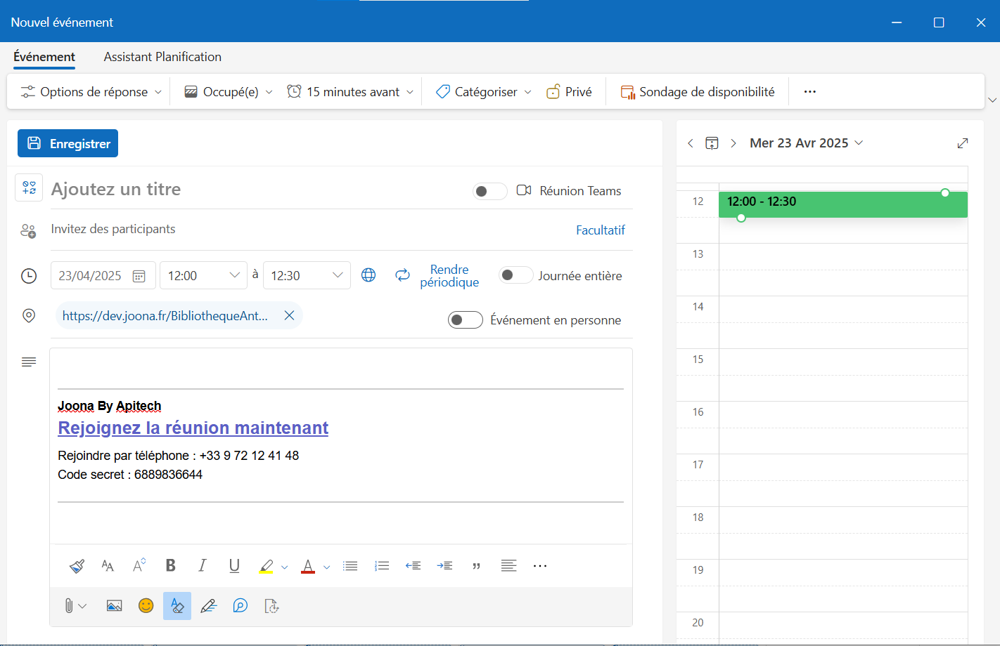

# Joona-outlook

# Description
**Joona Meet** est un Add-in pour Outlook  qui facilite l'organisation de réunions sur notre plateforme (https://joona.fr). Lors de la planification d'un événement via l'Outlook Planner, il génère automatiquement des liens de visioconférence Joona
Lorsque vous créez un nouvel événement dans votre calendrier Outlook. Plus besoin de copier-coller des liens manuellement, l'add-in s'occupe de tout pour vous.

# Installation

## Utilisateur Outlook 

Si vous êtes utilisateur Outlook, vous devez suivre les étapes ci-dessous : (Si vous êtes administrateur Outlook et que vous souhaitez diffuser l'Add-in vers l'ensemble de vos utilisateurs, suivez les étapes  dans la section [section administrateur outlook](#administrateur-outlook).)
- Téléchargez le fichier **manifest.xml** de l'add-in, situé dans ce dépôt.
- Cliquez sur le lien "https://aka.ms/olksideload". Cela ouvre Outlook sur le Web, puis charge la  boîte de dialogue Compléments pour Outlook  après quelques secondes.

- Sélectionnez **Mes compléments**.
- Dans la section **Compléments personnalisés**, sélectionnez **Ajouter un complément personnalisé**, puis choisissez **Ajouter à d’un fichier**.

- Sélectionnez le fichier **manifest.xml**.
- Sélectionnez **Ouvrir** pour installer le module complémentaire.

## Administrateur Outlook 

## Microsoft 365
Si vous êtes administrateur Outlook sur Office 365. Il est recommandé de suivre la documentation de Microsoft et d'ajouter l'URL de l'add-in.
- Lien vers la documentation : [https://learn.microsoft.com/fr-fr/microsoft-365/admin/manage/manage-deployment-of-add-ins?view=o365-worldwide](https://learn.microsoft.com/fr-fr/microsoft-365/admin/manage/manage-deployment-of-add-ins?view=o365-worldwide)

### Exchange Server
Si vous êtes administrateur Outlook sur un serveur Exchange. Il est recommandé de suivre la documentation de Microsoft et d'ajouter l'URL de l'add-in.
 - Lien vers la documentation : [https://learn.microsoft.com/fr-fr/exchange/add-ins-for-outlook-2013-help](https://learn.microsoft.com/fr-fr/exchange/add-ins-for-outlook-2013-help)

# Utilisation

- Créez un nouvel événement dans votre agenda
- Dans la page de création de l'événement, cliquez sur le bouton "Joona Meet"
- Votre invitation devrait ressembler à la capture d'écran ci-dessous : 

# Supprimer l'Add-in

- Accédez à la barre de navigation et sélectionnez **L’icône Plus d’applications**. **Plus d'applications > Ajouter des applications**.
- Sur la page **Applications**, sélectionnez **Gérer vos applications**.
- Sous **Gérer vos applications**, recherchez l’application que vous souhaitez supprimer et sélectionnez **Plus d’options > Supprimer**.

# Contact

Pour toute demande d'assistance. Vous devez vous adresser à vos assistants informatiques de proximité.
S'ils ne parviennent pas à résoudre votre problème, ils peuvent nous écrire à cette adresse :
support@apitech.fr